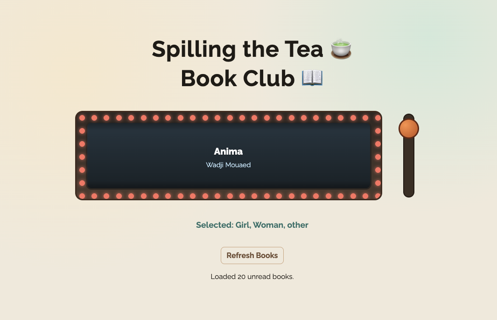

# Book Club Slot Machine

A vibecoded project — built by tinkering, tweaking, and iterating with Claude Code. Not production-grade software, just a fun personal tool that actually gets used.

A private web app for a book club with friends. Instead of manually picking the next book, members pull a slot machine lever to randomly select one from an unread list pulled live from Notion. Once a book is chosen, the app walks through confirming the host, scheduling the meeting, and sending calendar invites to all members — all from the same interface.

Hosted on a private custom domain.

---

## What it does

- **Slot machine roller** — pulls unread books from a Notion database and randomly selects one with a slot machine animation
- **Host rotation** — tracks the hosting order across sessions; suggests the next host automatically and allows choosing someone else, adjusting the sequence accordingly
- **Calendar invites** — after confirming a book and host, sends a `.ics` calendar invite via email to all members with the date, time, and host's address as the location
- **Notion as the source of truth** — books, members, host order, addresses, and emails all live in Notion; the app reads and writes directly to it
- **Mobile-friendly** — works on phone and desktop; lever can be dragged or tapped

---

## Tech stack

- **Backend**: Node.js + Express
- **Frontend**: Vanilla HTML, CSS, JavaScript (no framework)
- **Database**: Notion (via the Notion API)
- **Email**: Resend API
- **Hosting**: Railway
- **Domain**: Netlify DNS → Railway

---

## Notion setup

The app connects to two Notion databases:

### Books database
| Property | Type | Notes |
|----------|------|-------|
| Title | Title | Book title |
| Author | Text | Author name |
| Read | Checkbox | Checked = already read, excluded from roller |

### Members database
| Property | Type | Notes |
|----------|------|-------|
| Name | Title | Member name |
| Email | Email | Used for calendar invites |
| Address | Text | Used as meeting location in the invite |
| Current Host | Checkbox | Marks who is currently hosting |
| Order | Number | Rotation sequence; auto-managed by the app |

---

## Config

Secrets and API keys live in a `.env` file (not committed). Connections include a Notion integration for books and members data, and a Resend API key for outgoing invite emails.

## Deployment

Hosted on [Railway](https://railway.app), connected to this GitHub repo. Every push to `main` triggers an automatic redeploy. Environment variables are set in the Railway dashboard.

The host rotation order is stored in the **Order** column of the Notion members database, so it persists across redeploys without any additional storage.

---

## Patch notes

### March 2026
- **Slot machine animation** — spin extended from 1.4s to 5s with a quadratic ease-out slowdown over the final 2 seconds, like a real slot machine coming to rest
- **Confirm & spin again buttons** — replaced post-spin modals with persistent buttons below the slot machine so the selected book title stays visible while deciding
- **Calendar invites** — switched from Gmail SMTP (blocked by Railway) to [Resend](https://resend.com) API
- **Invite recipient checklist** — before sending, a checklist lets you deselect individual members; sorted alphabetically
- **Email HTML** — invite email now has a proper HTML layout with book, date, time, and location as a table; reduces spam scoring
- **Paris timezone** — invite times displayed and parsed in Europe/Paris time
- **Host address auto-fill** — meeting location in the calendar invite now pulls automatically from the host's Notion address (supports Notion's place property type)
- **Resilient Notion update** — if the calendar invite fails, a dialog offers to mark the book as read in Notion anyway
- **Selected book persists** — slot machine keeps showing the chosen book after sending the invite, until the page is reloaded
- **Subject line fix** — calendar invite subject now correctly reads "Book Club at [Name]'s"
